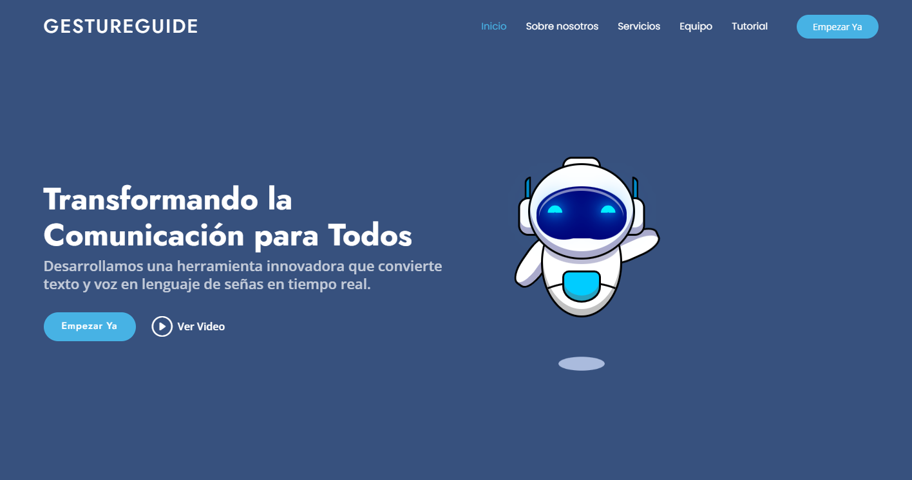
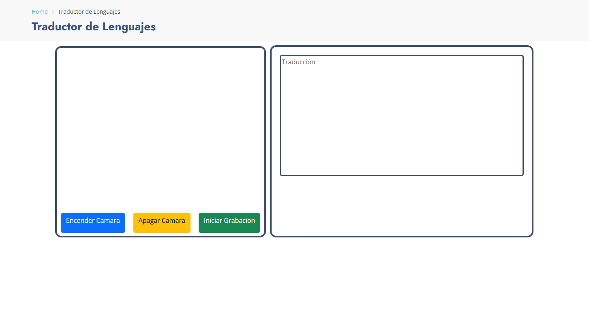
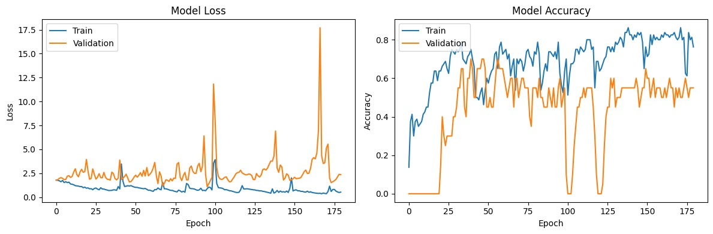

# 🌐 GestureGuide - Traducción de Lenguaje de Señas a Texto

## 🧠 Descripción

Bienvenidos a **GestureGuide**, un proyecto innovador que traduce lenguaje de señas a texto en tiempo real. Desarrollado por Cristian, Frandy, Jensey, y Ronald, este proyecto utiliza modelos de aprendizaje automático y tecnologías avanzadas de detección de gestos para facilitar la comunicación.




## 📁 Estructura del Proyecto

```plaintext
GestureGuide/
├── app.py
├── funtions.py
├── metrics.py
├── static/
│   ├── css/
│   ├── js/
│   ├── images/
│   └── videosData.json
├── templates/
│   ├── index.html
│   ├── tutorial-page.html
│   ├── starter-page.html
│   └── service-details.html
├── models/
│   └── modelofinal.keras
└── README.md
 ``` 

## ⌛ Proceso

### Fuente del dataset

[MS-ASL American Sign Language Dataset](https://www.microsoft.com/en-us/download/details.aspx?id=100121)

### Limpieza de datos

-------

### Manejo de Excepciones

- **Captura de Excepciones**: Utilizamos bloques try-except para identificar y gestionar errores específicos sin interrumpir el flujo de la aplicación.

-**Logging**: Empleamos el módulo logging de Python para registrar errores y eventos importantes, facilitando el diagnóstico y la resolución de problemas.

-**Manejo de Errores en Flask**: Manejamos excepciones en nuestras rutas Flask para proporcionar mensajes de error claros a los usuarios y registrar cualquier problema.

-**Validación de Datos**: Validamos los datos de entrada para evitar errores comunes y asegurar la integridad de la información procesada.

### Modelo de Machine Learning

Para nuestro proyecto "GestureGuide", estamos utilizando un modelo de Machine Learning basado en redes neuronales. En particular, hemos implementado una arquitectura de Redes Neuronales Recurrentes (RNN) con Long Short-Term Memory (LSTM). Este tipo de red es ideal para manejar datos secuenciales y temporales, como los gestos del lenguaje de señas.

### Estadísticos



## 🚀 Funcionalidades

- **Traducción en tiempo real** ⏱️: Convierte gestos del lenguaje de señas a texto en cuestión de segundos.
- **Interfaz amigable** 🖥️: Diseñada con Bootstrap para una experiencia de usuario intuitiva.
- **Compatibilidad multiplataforma** 📱: Funciona en cualquier navegador con soporte para cámaras web.
- **Modelos de IA avanzados** 🤖: Utiliza Keras y Mediapipe para una detección de gestos precisa.

## Estado del Proyecto

Actualmente, estamos en la fase de integración de nuestro modelo de inteligencia artificial version 1.0 con la página web utilizando Flask. Hemos logrado avances significativos en la implementación del sistema de detección de gestos y la conversión de lenguaje de señas a texto en tiempo real. Nuestro objetivo principal es ofrecer una experiencia fluida y precisa para los usuarios que utilizan nuestra aplicación "GestureGuide". Además, estamos trabajando en mejorar la interfaz de usuario para hacerla más intuitiva y accesible.


## Agradecimientos

Queremos expresar nuestro más sincero agradecimiento a todas las personas y organizaciones que han contribuido a este proyecto. En particular, queremos agradecer a:

- **Nuestros profesores y mentores**: Por su guía y apoyo constante durante todo el desarrollo del proyecto.

- **Los usuarios de prueba**: Por su tiempo y valiosos comentarios que nos han ayudado a mejorar nuestra aplicación.

- **Nuestros compañeros de equipo**: Cristian, Frandy, Jensey y Ronald, por su dedicación y esfuerzo incansable para hacer realidad este proyecto.

Sin el apoyo de todos ustedes, este proyecto no habría sido posible. ¡Gracias!

## 🛠️ Ejecución
1. ### Instala las dependencias:
 ```
 pip install -r requirements.txt
 ```

 2. ### Ejecuta la aplicación:
 ```
 python app.py
 ```